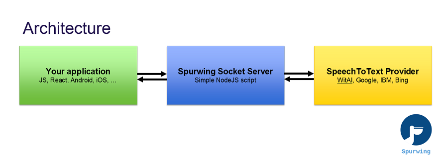

# Speech Recognition
This is an easy and simple Speech Recognition library for adding Voice Commands and Controls to all your applications. Whether you are building web apps, native apps or desktop apps, this technology can be integrated into any system with an internet connection. Learn more about the [Spurwing Scheduling API](https://github.com/Spurwingio/Appointment-Scheduling-API).


This code contains the server-client library and a demo implementation of Speech Recognition in the browser. It works on any device that uses a modern up-to-date web browser (FireFox or Chrome recommended).

[](https://www.youtube.com/watch?v=60llvnv3nDA)

YouTube demo: https://www.youtube.com/watch?v=60llvnv3nDA

## Intro


The architecture is straightforward as well. This library contains the implementation of the Spurwing Socket Server, which is also connected to a Speech-to-Text provider. For the latter we use WitAI (by Facebook), it's a completely free service and easy to use. Alternatively you can easily integrate any other STT provider (Google, IBM Watson, Bing, ...) but these may come at a price.



## Usage
1. This is a NodeJS implementation, you need node (with npm) v12+. Check your version using `node -v`.
2. Clone or download this respository.
3. Run `npm install` to make it download all necessary dependencies. (If it fails you may need to install C++ Build Tools).
4. We use WitAI as a free STT provider. You need to sign up and create an app here https://wit.ai/apps
5. Under `settings` you'll find your "Server Access Token".
6. Copy `config.sample.json` to `config.json` and edit it.
7. You have to provide a value for `WITAPIKEY` which is your "Server Access Token".
8. Use `node index.js` to launch the Socket Server.
9. Visit http://localhost:8002/Spurwing/audio/ to start testing.

* The Socket Server runs on port `8002` which you can change in `index.js`.

## Custom Client

Use the code snippets below to easily integrate it in your web application.

`index.html:`
```html
<script src="https://cdnjs.cloudflare.com/ajax/libs/socket.io/4.0.1/socket.io.min.js"></script>
<script src="https://spurwingio.github.io/Speech-Recognition/public/VAD.js"></script>     <!-- Required: VAD algorithm -->
<script src="https://spurwingio.github.io/Speech-Recognition/public/audio.js"></script>   <!-- Required: Speech Recognition Library -->

<script src="demo.js"></script>    <!-- Your implementation -->
```

`demo.js`
```js
const spa = new SpurwingAudio();

// on user click start mic:
spa.init().then((stream) => { // ask user for microphone access
    processStream(stream);
}).catch((err) => {
    alert("You must allow your microphone.");
    console.log(error);
});
// on user click stop mic:
// spa.end();

function processStream(stream) { // start Voice Activity Detection
  spa.startVAD(
      () => console.log('recording'), // function: on speech start
      (buffer, duration) => {         // function: on speech end
        socket.emit('stream', {buffer, id:0}) // send audio/speech fragment to server (optional custom id of fragment)
      }
  );
}

// create socket connection to server
let socket = io('localhost:8002', { // server domain
  path: "/Spurwing/audio/socket.io" // server endpoint
});

// capture "text" event from server (containing data)
socket.on('text', data => {
    console.log(data) // do something with the transcribed audio text
    
    // data structure: { raw: "hello", nlp: null, id: 0 }
});

```

## Demo screenshot


## About

Spurwing provides an enterprise grade API with Appointment Scheduling tools and Calendar Management Solutions for your business and projects. Easy to customize and effortless to integrate. We provide software teams with Time Management Solutions thanks to our enterprise grade Appointment Scheduling API. In addition we are building a completely free and open source marketplace containing widgets, chat bots, dashboards and integration solutions.

## Support
- For public issues and bugs please use the GitHub Issues Page.
- For enquiries and private issues reach out to us at support@spurwing.io
- Join our Discord Community Server: https://discord.gg/j3gd5Qk5uW
